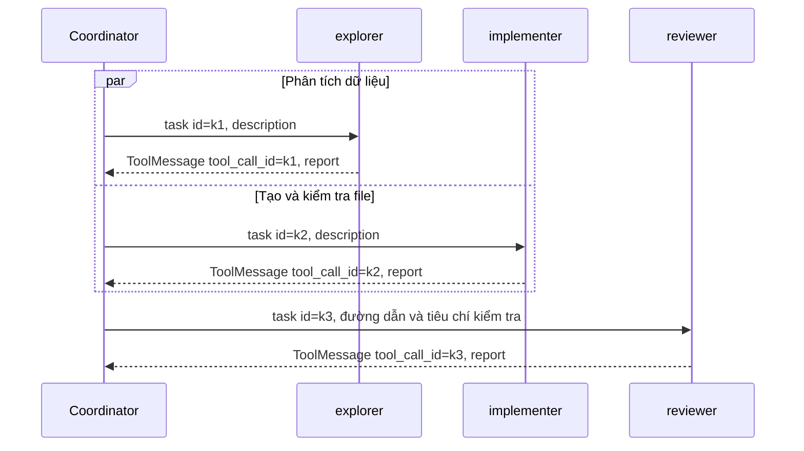

# Báo cáo Lab: Self evolving Agentic

Trạng thái: đã hoàn thành Phần 0 và mã harness của Phần 1 theo `README.md` và `GUIDE.md`; worker/giao tiếp có 14 ca kiểm chứng ngoại tuyến, tools/hợp tác có thêm 14 ca đạt. Các test Phần 0–1 đạt 30/30; hai test curator còn thất bại do TODO của Phần 3 trong repo. Phần 2 chưa hoàn tất: batch dừng sau hai lượt baseline do hạn mức token ngày của Groq; bốn lượt còn lại chưa chạy. Không có kết quả benchmark hoàn tất để kết luận về chất lượng.

## 1. Thông tin nhóm và cấu hình

| Họ tên | Mã sinh viên | Phần đóng góp |
|---|---|---|
| Đinh Hoàng Đức | 2A202602795 | Thực hành cá nhân; chuẩn bị môi trường và báo cáo. |

- Nhà cung cấp của các lượt đã lưu: Groq, endpoint tương thích OpenAI `https://api.groq.com/openai/v1`; cấu hình batch học là `LAB_MODEL=qwen/qwen3.8-27b`, `LAB_TEMPERATURE=0`, `LAB_MAX_INPUT_TOKENS=7000`, `LAB_MAX_OUTPUT_TOKENS=900`. Phần 0 dùng `openai/gpt-oss-20b`; các lượt chẩn đoán đã thử cả 20b, 120b và Qwen. Batch dự kiến sáu lượt học đặt `recursion_limit=20` để giới hạn chi phí; giá trị mặc định của runner vẫn là 60. Timeout mỗi lệnh shell là 120 giây.
- Môi trường: Windows với Ubuntu trên WSL2, Python 3.12.3 trong `.venv`; chạy trực tiếp trong WSL, không dùng Docker. Kernel: `6.6.87.2-microsoft-standard-WSL2`.
- Phiên bản đã cài: `deepagents==0.7.21`, `lab-deepagents==0.1.0`; `pip show` xác nhận lab được cài editable từ thư mục repo.
- Có 11 lượt tác vụ thật: 9 lượt chẩn đoán tại `results/attempts/` và 2 lượt batch học tại `results/baseline/`; cả 11 đều có `error`. Tổng usage ghi nhận **271.755 token**; tổng thời gian các lượt **1.747,6 giây**. Kiểm tra kết nối riêng dùng thêm 101 token; tour/test ngoại tuyến không tốn token. Bảng chi tiết ở mục 7 và phụ lục.
- Commit của tag `freeze`: chưa tạo (thuộc Phần 4).
- Khóa API chỉ lưu trong `.env`; `git check-ignore .env .venv` xác nhận cả cấu hình và môi trường ảo được Git bỏ qua.
- Căn cứ chọn mô hình: [Groq Tool Use](https://console.groq.com/docs/tool-use/overview) liệt kê Qwen hỗ trợ tool calling và parallel tool calling. Cấu hình sử dụng nhánh `LAB_BASE_URL` của `lab.model.make_model`, không cần cài thêm `langchain-groq`.

Policy giới hạn ngữ cảnh chỉ bật khi đặt `LAB_MAX_INPUT_TOKENS`: ghi đè profile đầu vào; tóm tắt ở 70% ngân sách ước lượng, giữ một message cùng cặp AI/tool liên quan; model tóm tắt giới hạn đầu ra 768 token. Filesystem middleware giới hạn mỗi trang kết quả ở 500 token ước lượng và chỉ dẫn offset đọc tiếp; dữ liệu gốc vẫn đầy đủ trong sandbox. Policy áp dụng cho tác tử chính, `general-purpose` và ba subagent tự định nghĩa. `LAB_MAX_OUTPUT_TOKENS` đặt giới hạn đầu ra trên client tương thích OpenAI có trường `max_tokens`. Đây là thay đổi harness để thích nghi hạn mức, cần giữ giống nhau giữa các điều kiện; tác động tới chất lượng phải được ghi nhận.

## 2. Giả thuyết (commit TRƯỚC tag `freeze`, Phần 4.0)

> Dự đoán điều kiện nào đạt điểm cao nhất trên **tác vụ đánh giá** và vì sao. Nêu căn cứ từ phân loại lỗi (mục 4) và từ tài liệu tham khảo. Điền cả ba dòng; `verify_freeze.py` kiểm tra điều này.

- H1 (subagents so với baseline):
- H2 (skills-auto so với baseline):
- H3 (tác vụ học so với tác vụ đánh giá):

## 3. Làm quen Deep Agents (Phần 0.3)

Kết quả dưới đây lấy từ `scripts/tour.py` với `ScriptedChatModel` và `LocalShellBackend`, không gọi API.

1. Tác tử mặc định có 9 công cụ: `ls`, `read_file`, `write_file`, `edit_file`, `delete`, `glob`, `grep`, `execute`, `task`. Bảy công cụ đầu thao tác hoặc tìm kiếm tệp; `execute` chạy lệnh shell và trả về stdout/stderr cùng mã thoát; `task` giao việc cho subagent.
2. `general-purpose` là subagent mặc định dùng để nghiên cứu câu hỏi phức tạp, tìm tệp/nội dung và thực hiện tác vụ nhiều bước; nó có các công cụ như tác tử chính. Tác tử chính gọi `task` với `subagent_type` và mô tả công việc. Mỗi lần gọi mặc định không giữ trạng thái: subagent chỉ thấy prompt được giao, không thấy toàn bộ hội thoại của tác tử chính, rồi trả về một báo cáo cuối. Vì vậy prompt giao việc phải chứa đủ yêu cầu, đường dẫn và định dạng kết quả; tác tử chính cần kiểm tra và tóm tắt báo cáo cho người dùng.
3. Tour in system prompt mặc định là `''`. Tuy nhiên mô tả công cụ vẫn chứa chỉ dẫn hành vi:

   - Từ `task`: “Launch an ephemeral subagent to handle a complex, multi-step task.” — giao một tác vụ phức tạp, nhiều bước cho subagent tạm thời.
   - Từ `execute`: “Quote paths containing spaces (e.g. cd \"/path/with spaces\").” — đặt đường dẫn có dấu cách trong dấu nháy khi chạy shell.

Về cấu trúc lab: chế độ `single` có tác tử chính và subagent mặc định `general-purpose`; chế độ `subagents` thêm `explorer`, `implementer`, `reviewer`. `curator` là bước gọi mô hình riêng để sinh skill từ phản hồi tác vụ học, không phải worker được `task` gọi. Đã cài đặt `get_subagents`, `make_backend`, `build_agent`, `run_task`; `curate_skills` còn là TODO của Phần 3.

### Kiến trúc điều phối đã cài đặt

| Khái niệm | Ánh xạ vào repo |
|---|---|
| Agent | Tác tử chính và các subagent được tạo bởi Deep Agents; mỗi subagent tự định nghĩa có tên, mô tả khi gọi và system prompt riêng. |
| Supervisor / Router | Tác tử chính trong `build_agent` đọc yêu cầu, chọn công cụ hoặc gọi `task`, kiểm tra báo cáo trả về và quyết định tiếp tục hay dừng. |
| Shared state | State `messages` của graph giữ hội thoại luồng chính; các agent dùng chung file trong sandbox. Subagent mặc định có ngữ cảnh cô lập: không được giả định nó thấy toàn bộ state/hội thoại của tác tử chính. |
| Handoff | Lời gọi `task` truyền mô tả công việc và `subagent_type`; subagent trả báo cáo cuối, sau đó quyền xử lý trở về tác tử chính. |
| LangGraph | `create_deep_agent` trả graph đã biên dịch; runner dùng `stream_mode="values"` để giữ trạng thái cuối đã phát ra khi có lỗi. |
| Guardrail | `recursion_limit=60`; timeout shell 120 giây; `inherit_env=False`; sandbox tạm ngoài repo được tự dọn; `skills_modified` phát hiện thay đổi skill. Không có retry tác vụ tự động làm tăng token mà không được ghi nhận. |
| Trace | `trace.md` lưu luồng chính; bản ghi mới có `communications`, `worker_errors` và `tool_executions` ghi cả công cụ bên trong worker. `run.json` tiếp tục lưu UTC timestamp, điểm/check, token, thời gian và hash skill. Token cộng cả subagent; trường đếm `tool_calls` vẫn chỉ đếm luồng chính. |
| Benchmark | Ba điều kiện do repo định nghĩa: `baseline`, `subagents`, `skills-auto`. Phần 2 chỉ đo ba tác vụ học; tập đánh giá chờ viết giả thuyết và đóng băng skill ở Phần 4. |

Backend shell không kế thừa biến môi trường của tiến trình cha: chỉ nhận `PATH`, `HOME` trỏ sandbox và `PYTHONDONTWRITEBYTECODE`. Cả tác tử chính và subagent đều nhận quy ước đường dẫn tương đối từ prompt có sẵn. Khác với sơ đồ shared state tổng quát, ngữ cảnh hội thoại của subagent mặc định không chia sẻ toàn bộ; coordinator phải gửi đầy đủ yêu cầu khi giao việc.

## 4. Đường cơ sở và phân loại lỗi (Phần 2.2)

> Chỉ dùng tác vụ học. Mỗi dòng là một check thất bại.

| Tác vụ | Check thất bại | Nhóm lỗi (A-G) | Bằng chứng (trích ngắn từ `detail` hoặc vết) |
|---|---|---|---|
| Chưa có lượt baseline hoàn tất để phân loại | — | — | `code-learn` gặp HTTP 429; `data-learn` dừng ở guardrail sau vòng đọc CSV lặp lại. Chưa có cơ sở phân loại check của một tác vụ thực thi hoàn tất. |

Chưa xác định nhóm lỗi chiếm đa số hoặc hiệu quả skill. Những check báo thiếu output sau lỗi API phản ánh việc thực thi bị dừng, chưa chứng minh tác tử bỏ qua đặc tả hay báo cáo sai. Với `data-learn`, vết cho thấy đã đọc README và đọc lặp hai phần CSV, không gọi `write_file`/`execute`; guardrail dừng trước khi có `answer.json` và `clean.csv`. Đây là bằng chứng về vòng lặp của cấu hình hiện tại; không gán tất cả check thiếu file cho một lỗi kỹ thuật dữ liệu cụ thể. Cần tách ảnh hưởng của tóm tắt và ngân sách khỏi chất lượng tác tử trước khi kết luận. Thống kê thô 0/12 check kỹ thuật và 0/6 check quy ước ở mục 7 không được dùng làm bằng chứng phủ định A–D vì cả hai lượt đều bị dừng.

## 5. Điều kiện `subagents` (Phần 2.3)

- Các subagent đã định nghĩa: `explorer` đọc đặc tả/code/dữ liệu và báo cáo bằng chứng, không sửa file; `implementer` thực hiện yêu cầu rõ ràng, giữ nguyên test có sẵn và tự kiểm tra; `reviewer` kiểm chứng độc lập output theo yêu cầu, không sửa file. Tách ba vai trò để coordinator có thể chọn bước điều tra, thực hiện hoặc kiểm chứng phù hợp.
- Ba lượt điều kiện `subagents` chưa chạy vì batch dừng ở hạn mức ngày. Chưa thể đánh giá nội dung giao việc, kiểm chứng báo cáo worker hoặc so sánh token/thời gian với baseline. Hai lượt baseline có `subagent_calls=0`; số này không đại diện cho điều kiện `subagents`.

### Worker và giao tiếp theo kiến trúc của repo

Tài liệu tham khảo “Phần 3: Worker Agents & Communication” mô tả các tệp `src/agents/*`, `src/communication/message_queue.py` và `tests/test_03_workers.py`. Repo này định nghĩa worker trong `src/lab/subagents.py`, sử dụng graph Deep Agents và công cụ `task`. Phần worker thuộc Phần 1–2 của GUIDE; Phần 3 trong repo là curator. Theo RUBRIC, mã harness được triển khai trong các hàm TODO; bản này hoàn thiện giao tiếp qua API framework đang dùng.

| Thành phần tham khảo | Thành phần đang dùng | Trách nhiệm và công cụ |
|---|---|---|
| Data worker | `explorer` | Đọc đặc tả và mẫu CSV/JSON/log; dùng Python qua `execute` để tính dữ liệu lớn, trả insight và bằng chứng. Prompt yêu cầu không sửa file. |
| Code worker | `implementer` | Dùng công cụ file và `execute` để sửa code, tạo output và chạy kiểm chứng; giữ nguyên test có sẵn. |
| Evaluator worker | `reviewer` | Kiểm tra artifact và test output theo yêu cầu; nêu kiểm tra chưa thực hiện; không tự bịa điểm chất lượng. Prompt yêu cầu không sửa file. |
| Vòng xử lý BaseWorker | Graph của từng subagent | Deep Agents quản lý model/tool loop; graph cung cấp `invoke` và `ainvoke`. Các worker đặt `mode="isolated"`, chỉ nhận nội dung giao việc. |
| Truyền và nhận message | `task` và `ToolMessage` | `subagent_type` chọn worker; `description` mang yêu cầu, đường dẫn và quy tắc; `tool_call_id` liên kết báo cáo với đúng lời gọi, kể cả nhiều worker chạy đồng thời. |
| Log giao tiếp | `run.json.communications` | Mỗi sự kiện có `type`, `id`, `from`, `to`, `timestamp`, `content`; phản hồi có `tool_status`. Timestamp là thời điểm runner quan sát state, UTC, không phải thời điểm bắt đầu/kết thúc nội bộ worker. |

Worker dùng các công cụ file/shell được framework cấp; phạm vi vai trò được hướng dẫn bằng prompt, chưa khóa quyền ghi theo từng worker. Repo không có kết nối SQL hoặc phụ thuộc pandas: worker được hướng dẫn dùng thư viện đã cài hoặc standard library. Shell tiếp tục dùng backend chung với timeout 120 giây và môi trường không kế thừa khóa API.

Prompt của ba worker yêu cầu báo cáo JSON gồm `status`, `result`, `files_changed`, `checks`, `errors`. Mỗi check nêu `check`, `passed`, `evidence`; check chưa thực hiện dùng `null`. Đây là hợp đồng trong prompt, chưa ép toàn bộ schema bằng structured output. Runner chấp nhận báo cáo dạng text để tương thích subagent mặc định, và nhận diện báo cáo JSON có `status="error"`.

Trong chế độ `subagents`, `ToolErrorMiddleware` chuyển các lỗi ValueError/FileNotFoundError/PermissionError/TimeoutError từ lời gọi `task` thành `ToolMessage(status="error")` với đúng ID, loại lỗi và thông báo ngắn; không đưa nguyên văn exception nội bộ vào báo cáo. Lỗi provider đã chuẩn hóa và lỗi RuntimeError không bị đổi thành thành công: chúng tiếp tục được runner ghi vào `error`. Middleware không tự retry. Cách xử lý sync/async theo API [ToolErrorMiddleware của LangChain](https://reference.langchain.com/python/langchain/agents/middleware/tool_error/ToolErrorMiddleware).

Runner lưu báo cáo worker lỗi trong `worker_errors`, gồm `tool_call_id`, tên worker và report. Cả lỗi giao việc và lỗi do worker tự báo đều đánh dấu bản ghi có `error`; coordinator vẫn có thể nhận kết quả worker khác. Mọi lỗi được giữ lại, kể cả khi coordinator tiếp tục, nên không xem một lượt có lỗi worker là lượt thực thi sạch chỉ vì có artifact. Khi graph dừng trước phản hồi, `communications` giữ yêu cầu đã quan sát; mỗi sự kiện chỉ ghi một lần dù stream lặp lại lịch sử.

Luồng được kiểm chứng ngoại tuyến:



Diagram mô tả ca kiểm chứng; model thật vẫn tự quyết định worker và thứ tự giao việc. Kết quả kiểm chứng sau đây xác nhận cơ chế giao tiếp, không chứng minh chất lượng xử lý tác vụ của Groq.

| Ca kiểm chứng ngoại tuyến | Kết quả |
|---|---|
| Sync và async: hai worker bắt đầu đồng thời, tạo file/đếm dòng bằng công cụ thật, reviewer đọc artifact, trả đúng ba ID | 2/2 đạt |
| Sync và async: một worker timeout; trả lỗi đúng ID, giữ artifact và báo cáo worker còn lại; ẩn marker exception nội bộ | 2/2 đạt |
| Sync và async: worker tự trả JSON lỗi; coordinator nhận đúng report và kết quả worker khác | 2/2 đạt |
| Sync và async: RuntimeError tiếp tục được chuyển lên caller | 2/2 đạt |
| Sync và async: ModelRateLimitError tiếp tục được chuyển lên caller | 2/2 đạt |
| Runner: timeout, JSON lỗi, thành công, provider lỗi; kiểm tra log request/reply hoặc request còn chờ, UTC timestamp và file JSON đã lưu | 4/4 đạt |
| Tổng | **14/14 đạt, exit code 0** |

Các model trong kiểm chứng là model điều khiển kịch bản ngoại tuyến, được ghi rõ trong [verify_worker_communication.py](verify_worker_communication.py). Công cụ file/shell thực thi thật trong thư mục tạm ngoài repo; model và lỗi provider là dữ liệu kiểm thử. Các bản ghi kiểm thử nằm trong thư mục tạm và được dọn, không ghi vào `results/`, không cộng token giả vào benchmark. Không sửa test/workspace có sẵn, không gọi Groq cho bước này.

### Tích hợp tools và hợp tác agent (Phần 4 của tài liệu tham khảo)

Repo không có `src/tools/*`, `tests/test_04_tools.py` hoặc `scripts/test_tool_integration.py` trong tài liệu tham khảo. Các công cụ file và shell được Deep Agents tạo từ backend; tích hợp được thực hiện trong `make_backend`, `build_agent` và `run_task`, theo phạm vi README/RUBRIC. Không thêm kết nối database thật hoặc sửa bộ chấm có sẵn.

| Nhu cầu | Công cụ/cơ chế của repo | Kiểm chứng thực tế |
|---|---|---|
| BaseTool và input | Tool schema của framework; kiểm tra input của backend | Command trống, file thiếu, chuỗi cần sửa không tồn tại đều báo lỗi; đường dẫn `../` và symlink ra ngoài bị từ chối ở công cụ file. |
| CSV và aggregation | Python standard library `csv`, `decimal` qua `execute` | Fixture gồm 5 dòng: 3 hợp lệ, 2 trống/sai; tổng 1.375 cent, giữ khoản âm và không cộng bằng float. |
| Truy vấn database | `sqlite3` qua `execute` | Database SQLite tổng hợp trong thư mục tạm; mở URI `mode=ro`, dùng tham số truy vấn và đóng connection. Tổng SQL bằng CSV; thử DELETE trên fixture bị từ chối. Đây là kiểm chứng cách dùng thư viện qua shell, chưa có tool SQL chuyên biệt nhận truy vấn tùy ý. |
| Tạo/sửa/chạy code | `write_file`, `edit_file`, `execute` | Implementer viết script, sửa tiêu đề, chạy script thật để tạo `answer.json` và biểu đồ `summary.svg`. Không cần pandas/matplotlib cho fixture này. |
| Validation, comparison, scoring | Reviewer chạy checker; runner gọi `lab.grading.grade` có sẵn | Ba check độc lập so tổng, số dòng/quyền đọc database, và cấu trúc/nội dung SVG. Điểm là số check đạt chia tổng; không suy ra accuracy từ độ dài câu trả lời. |
| Log công cụ | Callback tại runner, `run.json.tool_executions` | Ghi cả tool của coordinator và worker: ID, parent ID, tên, input, UTC timestamp, trạng thái, thời gian và output. Handoff giữ ID riêng trong `communications`. |

Backend đặt `max_output_bytes=10_000`; phiên bản đang dùng thực tế cắt theo số ký tự Python, rồi thêm thông báo truncation. Kiểm chứng output 20.000 ký tự cho thấy giữ 10.000 ký tự dữ liệu và cờ `truncated=True`. Đây là giới hạn output trả lại, chưa phải giới hạn bộ nhớ khi thu stdout/stderr. Timeout mặc định vẫn là 120 giây theo GUIDE; kiểm chứng dùng override 1 giây cho lệnh ngủ 2 giây, thu exit code 124. Không thiết lập giới hạn RAM hay CPU cứng; timeout mặc định có thể được override theo API backend.

`virtual_mode=True` bảo vệ đường dẫn công cụ file; `inherit_env=False` chặn kế thừa khóa trong môi trường shell. Tuy nhiên shell vẫn có quyền truy cập host: kiểm chứng chỉ đọc một file tổng hợp bên ngoài thư mục gốc để xác nhận giới hạn này, không truy cập file bí mật. Thư mục tạm bảo vệ bản workspace gốc khỏi sửa nhầm trong luồng bình thường; backend này không cung cấp cô lập tiến trình/hệ điều hành. Giới hạn được xác nhận trong mã phiên bản đã cài và [tài liệu LocalShellBackend chính thức](https://reference.langchain.com/python/deepagents/backends/local_shell/LocalShellBackend).

Log tool dùng callback có khóa để nhận sự kiện từ các worker chạy đồng thời. Trạng thái `completed` nghĩa là công cụ đã trả kết quả; Python exit code khác 0 hoặc checker không đạt vẫn phải đọc từ output. Exception có trạng thái `error`, chỉ ghi loại lỗi và thông báo chung, không ghi nguyên văn exception. Input/output log giới hạn 10.000 ký tự mỗi trường; sự kiện chưa có callback kết thúc giữ `running`, không được suy diễn thành thành công. Trường `tool_calls` và cách đo token theo RUBRIC được giữ nguyên.

| Nhóm kiểm chứng trong `report/verify_tool_integration.py` | Kết quả |
|---|---|
| Backend: môi trường, file UTF-8/đường dẫn chung, input lỗi, traversal/symlink, stdout/stderr/exit code, timeout, output dài, giới hạn shell | **8/8 đạt** |
| Hợp tác sync/async trên artifact đúng: explorer → implementer → reviewer | **2/2 đạt**, checker 3/3, điểm 1,0 |
| Hợp tác sync/async khi fixture cố ý sửa sai tổng trong artifact | **2/2 đạt** vì phát hiện lỗi, checker 2/3, điểm 0,666… |
| Runner với artifact đúng/sai: chấm điểm, worker error, 8 log tool có thời gian và 6 sự kiện handoff, JSON đã lưu | **2/2 đạt** |
| Tổng ca kiểm chứng tools/hợp tác | **14/14 đạt**, exit code 0 |

Fixture và tuyến gọi model được điều khiển bằng script ngoại tuyến; công cụ, database, artifact và checker thực thi thật. Điểm trên là điểm của fixture tổng hợp, không phải tác vụ học/đánh giá của lab hay bằng chứng chất lượng Groq. File/checker tổng hợp chỉ nằm trong thư mục tạm; bản ghi được tự dọn và không ghi vào `results/`. Không sinh skill, không đóng băng hay chạy lại benchmark trong bước tích hợp tools.

## 6. Self-evolving: skill do curator sinh (Phần 3)

- Chưa triển khai/chạy curator (Phần 3); chưa sinh, xóa hoặc sửa tay skill. Bảng này chờ kết quả curator sau khi các lượt học đủ điều kiện hoàn tất.

| Skill | Tổng quát hay riêng cho tác vụ học? | Đúng hay sai (nêu chỗ sai nếu có) | Độ dài, `description` và `skills_read` ở Phần 3.4 |
|---|---|---|---|
| | | | |

## 7. Kết quả so sánh (Phần 4.3, 4.4)

Đây là bảng **tạm**, chưa phải bảng Phần 4 đủ ba điều kiện/sáu tác vụ. Nội dung dưới đây sinh từ `lab.compare` và khớp `report/table.md`; module này tính cả bản ghi có lỗi, nên điểm/mean score trong bảng không chứng minh chất lượng lời giải. Cả hai lượt đều có `error`, `skills_modified=false`, `skills_read=0`.

| Task | baseline |
|---|---|
| code-learn | 0/10 |
| data-learn | 0/8 |
| **Mean score - learning tasks** | 0.00 |
| **Mean score - evaluation tasks** | - |
| **Mean tokens per run** | 48,040 |
| **Runs that read a skill** | 0/2 |

| Lượt batch | Token | Giây | Tool call chính | Giao việc | Trạng thái |
|---|---:|---:|---:|---:|---|
| baseline/data-learn | 85.833 | 577,4 | 13 | 0 | GraphRecursionError tại giới hạn 20; đọc CSV lặp lại, chưa tạo output |
| baseline/code-learn | 10.248 | 77,0 | 8 | 0 | HTTP 429: TPD 200.000, Used 197.898, Requested 5.322 |
| Tổng batch đã chạy | **96.081** | **654,4** | **21** | **0** | Còn thiếu baseline/logs-learn và ba lượt subagents |

Lượt thứ hai nhận phản hồi hạn mức ngày; batch dừng, không tự chạy lại hoặc gọi tiếp bốn tác vụ bị chặn. Bản ghi `logs-learn` cũ với model 120b được đối chiếu hash với archive rồi bỏ bản sao khỏi thư mục baseline để tránh trộn cấu hình. Bản gốc vẫn nguyên vẹn trong `results/attempts/groq-120b-logs-learn/`.

Kết quả thật của `python scripts/check_breakdown.py`:

```text
condition     role    technical  house rules  mean tokens  read a skill
baseline      learn     0/12         0/6           48,040      0/2
(evaluation rows are hidden until the git tag `freeze` exists)
```

## 8. Phân tích

> Trả lời từng câu bằng số liệu từ mục 7 và bằng chứng từ vết. Kết quả âm hoặc không có khác biệt vẫn hợp lệ nếu được phân tích tốt.

Chưa đủ dữ liệu trả lời sáu câu so sánh dưới đây: không có lượt học thực thi hoàn tất, chưa có `subagents`/`skills-auto`, chưa chạy đánh giá hoặc đóng băng. Có thể kết luận giới hạn hiện tại của harness: lượt data dùng 85.833 token cho 13 tool call nhưng không tạo output; lượt code bị quota ngày chặn trước khi sửa/kiểm chứng. Không thể suy ra hiệu quả đa tác tử, skill, khả năng tổng quát hóa hoặc mức nhiễu từ hai lượt này.

1. So với `baseline`, điều kiện nào cải thiện điểm tác vụ **học**? Điều kiện nào cải thiện điểm tác vụ **đánh giá**? Có điều kiện nào cải thiện tác vụ học nhưng không cải thiện tác vụ đánh giá? Nếu có, đó là dấu hiệu gì?
2. Tách điểm thành check kỹ thuật và check quy ước (`rule_`). Skill do curator sinh giúp nhóm check nào? Check quy ước **mới** của tác vụ đánh giá có được skill giúp không, và vì sao?
3. Dựa vào vết và `skills_read`, giải thích một check mà skill giúp đạt và một check mà skill không giúp (skill chưa được đọc, đọc nhưng không làm theo, skill thiếu hoặc sai).
4. Chi phí: so sánh số token trung bình giữa các điều kiện. Điều kiện nào có hiệu quả tốt nhất theo điểm trên mỗi token? Đa tác tử có đáng chi phí trong thí nghiệm này không?
5. Có dấu hiệu rò rỉ dữ liệu hoặc quá khớp nào trong skill sinh ra không? Nhóm đã phòng tránh như thế nào?
6. Nhiễu: so sánh điểm tác vụ học của cùng bộ skill ở Phần 3.4 (đã sao lưu) và sau đóng băng. Chênh lệch bao nhiêu? Nó cho biết điều gì về độ tin cậy của các chênh lệch trong bảng ở mục 7?

## 9. Hạn chế và tính hợp lệ

> Nêu ít nhất 3 hạn chế và ảnh hưởng của từng hạn chế đến kết luận (ví dụ: chỉ 3 tác vụ mỗi vai trò, mỗi cấu hình chạy một lần, nhiễu của mô hình, tác vụ do giảng viên thiết kế sẵn quy ước, chỉ một mô hình).

1. Hạn mức Groq thực tế thấp hơn cửa sổ ngữ cảnh quảng bá: phản hồi API ghi giới hạn 7.000 token đầu vào/phút, 1.000 token đầu ra/phút và 200.000 token/ngày. Đổi khóa không bảo đảm tăng hạn mức; lỗi hạ tầng làm các lượt không đủ điều kiện để kết luận về chất lượng tác tử.
2. Quá trình chẩn đoán đã thay model và policy ngữ cảnh. Không so sánh trực tiếp các lượt khác cấu hình; giữ riêng bản ghi cũ và không lựa chọn lại lượt chỉ vì điểm thấp.
3. Token counter của middleware là ước lượng. Tóm tắt và phân trang có thể làm mất chi tiết trong ngữ cảnh mô hình hoặc khiến tác tử đọc lặp, dù file gốc không đổi. Chi phí token gồm cả tóm tắt và subagent; trace chỉ thể hiện luồng chính.
4. Tập học chỉ có ba tác vụ; chưa chạy curator, chưa đóng băng và chưa có kết quả đánh giá. Chưa thể suy ra khả năng tổng quát hóa, quá khớp hoặc lợi ích của skill.

## 10. Kết luận

Harness điều phối, backend và runner đã qua 30 test Phần 0–1. Hai lượt batch học bị dừng bởi vòng lặp/guardrail và quota ngày; chưa có bằng chứng đủ để kết luận subagents hoặc skill cải thiện điểm. Các bản ghi thật và lượt chẩn đoán được giữ để kiểm toán usage. Cần quota khả dụng và kiểm chứng cách quản lý ngữ cảnh giúp tác tử chuyển từ đọc sang thực hiện, rồi hoàn tất tác vụ học trước khi chạy curator và đóng băng.

## Phụ lục

- Lệnh Phần 0 đã chạy (theo thứ tự): các lệnh Python chạy trong Ubuntu WSL, tại `/mnt/e/AIVin/K4-DAY20-MULTIAGENTS-DinhHoangDuc-2A202602795`, bằng interpreter `.venv/bin/python`.

```bash
.venv/bin/python -m pip install -e .
# Lần cài đầu bị gián đoạn; chạy lại để hoàn tất:
.venv/bin/python -m pip install -e . --disable-pip-version-check --quiet
.venv/bin/python -m pytest tests/test_01_provided.py -q
.venv/bin/python scripts/tour.py
.venv/bin/python -m pip show deepagents lab-deepagents
.venv/bin/python -c "from lab.model import make_model; print(make_model().invoke('Reply with OK').content)"
```

Lệnh kiểm tra mô hình cuối là dạng rút gọn tương đương script đã chạy qua stdin; script thực tế còn in `usage_metadata` và xử lý lỗi.

| Kiểm tra | Kết quả thực tế |
|---|---|
| Remote repo | `origin` trỏ tới `ducdh205/K4-DAY20-MULTIAGENTS-DinhHoangDuc-2A202602795` trên GitHub; repo đã clone. |
| Môi trường và thư viện | Python 3.12.3 trong `.venv` WSL; cài editable thành công. |
| `tests/test_01_provided.py` | 15/15 test đạt, exit code 0. |
| Tour | Exit code 0; có 9 công cụ; system prompt mặc định `''`. |
| Groq Models API | Xác thực thành công; model `openai/gpt-oss-20b` khả dụng. |
| Kết nối qua `lab.model.make_model` | Trả lời `OK`; 74 token đầu vào, 27 token đầu ra, tổng 101 token. Đây là kiểm tra kết nối, chưa phải lần chạy tác vụ. |
| Git bỏ qua cấu hình | `git check-ignore .env .venv` trả về cả hai đường dẫn; `git ls-files .env` không có kết quả. |

- Thử thách mở rộng (nếu có): hướng chọn, kết quả, nhận xét.
- Ghi chú: làm theo tài liệu của repo: test Phần 0 có 15 test và mục 3 trả lời ba câu về Deep Agents trong `GUIDE.md`, thay vì số test/câu hỏi của bản tham khảo. Không đọc trực tiếp check hoặc kết quả tác vụ đánh giá để chuẩn bị skill; chưa chạy thí nghiệm hoặc tạo tag `freeze`.

### Kiểm chứng mã điều phối và runner

```bash
.venv/bin/python -m pytest tests/test_02_agent.py::test_subagents_have_required_fields -v
.venv/bin/python -m pytest tests/test_02_agent.py -v
.venv/bin/python -m pytest tests/test_03_runner.py -v
.venv/bin/python -m pytest -v
```

Kết quả thực tế: test định nghĩa subagent đạt 1/1; toàn bộ `test_02_agent.py` đạt 9/9; `test_03_runner.py` đạt 6/6; toàn bộ suite có **30 passed, 2 failed**. Hai lỗi đều là `NotImplementedError` tại `curate_skills`, thuộc Phần 3 chưa triển khai. Test dùng mô hình giả theo thiết kế của repo, không phải dữ liệu benchmark; không ghi kết quả giả vào `results/`.

Đã đối chiếu với commit gốc `ad29c55`: `tests/`, `tasks/`, `scripts/` và các module có sẵn không thay đổi. So sánh AST xác nhận nguyên vẹn bốn hằng số prompt trong `agent.py`, cùng `CONDITIONS`, `render_trace`, `main` trong `runner.py`.

Commit cục bộ: `6825b08` (subagent), `4fdd8ad` (backend/agent), `dd16b3a` (runner), `a93efab` (profile ngữ cảnh), `00de89b` (metadata model/usage), `ecb5583` (tóm tắt giới hạn đầu ra), `79c3e87` (phân trang tool result), `4e0c7b0` (giới hạn đầu ra chính và ghi cấu hình). Chưa push.

Lệnh chạy thật đầu tiên bị bộ xét duyệt tự động từ chối trước khi thực thi vì cần ủy quyền rõ ràng cho việc gửi payload benchmark tới Groq. Sau đó người dùng đã xác nhận cho phép sáu lượt học (baseline/subagents trên ba tác vụ). Lệnh bị từ chối không được tính là lần chạy API.

### Lượt chẩn đoán trước khi chốt cấu hình học

Mỗi hàng có bản ghi và vết nguyên trạng tại `results/attempts/<tên>/`, cùng `configuration.json` ghi model, tham số và commit. Tất cả đều có lỗi thực thi, không dùng để phân loại lỗi A–G hoặc kết luận về hiệu quả tác tử.

| Thư mục lượt chạy | Token ghi nhận | Giây | Lỗi |
|---|---:|---:|---|
| groq-120b-code-learn | 0 | 10,6 | HTTP 400: gọi công cụ `exec` không có trong danh sách |
| groq-120b-data-learn | 7.917 | 30,2 | HTTP 400: JSON lời gọi công cụ không hợp lệ |
| groq-120b-logs-learn | 8.163 | 72,6 | HTTP 400: JSON lời gọi công cụ không hợp lệ |
| groq-20b-data-learn | 7.911 | 40,6 | HTTP 400: JSON lời gọi công cụ không hợp lệ |
| groq-qwen-data-learn-413 | 17.617 | 89,2 | HTTP 413: yêu cầu 7.320, hạn mức đầu vào 7.000 |
| groq-qwen-data-learn-4500-overflow | 5.034 | 4,2 | ContextOverflowError: cặp gọi/kết quả đọc không vừa ngân sách sau tóm tắt |
| groq-qwen-data-learn-6000-413 | 22.681 | 112,0 | HTTP 413: yêu cầu 7.364, hạn mức 7.000 |
| groq-qwen-data-learn-7000-413 | 5.034 | 3,1 | HTTP 413: yêu cầu 7.198, hạn mức 7.000 |
| groq-qwen-data-learn-paged-429 | 101.317 | 730,7 | Đọc CSV lặp lại; HTTP 429: đầu ra dự kiến 1.650, hạn mức đầu ra 1.000 |
| Tổng 9 lượt | **175.674** | **1.093,2** | |

Usage được cộng từ callback của các lời gọi hoàn tất, gồm tóm tắt và subagent. Lời gọi lỗi có thể không trả usage, vì vậy đây là tổng token ghi nhận, không phải hóa đơn. Tour/test ngoại tuyến không thuộc tổng này; kiểm tra kết nối `OK` dùng thêm 101 token.

Sau các phản hồi giới hạn, đặt output chính 900 token, nâng ngưỡng tóm tắt từ 50% lên 70% và hạ recursion limit của batch học xuống 20. Người dùng xác nhận tiếp tục dùng Groq hiện tại; không thay đổi gói dịch vụ. Cấu hình batch được giữ giống nhau cho baseline và subagents, không dùng dữ liệu đánh giá để điều chỉnh.

Kiểm chứng cuối sau thay đổi giới hạn đầu ra: **30 passed in 67,82s** (`test_01`, `test_02`, `test_03`). Toàn bộ suite trước đó có **30 passed, 2 failed in 76,10s**; hai lỗi chỉ thuộc curator TODO. Script kiểm chứng bổ sung ngoại tuyến xác nhận phân trang có offset, file gốc nguyên vẹn và client nhận `max_tokens=900`, profile đầu vào 7.000; không gọi API.

### Batch học và tái lập

Batch thực tế chạy qua Python stdin, gọi `run_task` theo thứ tự `baseline` rồi `subagents`, mỗi điều kiện theo `data-learn`, `code-learn`, `logs-learn`. Mã gọi rút gọn dưới đây giữ cùng thứ tự và điều kiện dừng; script thực tế còn ghi `configuration.json` và in đầy đủ số liệu cho từng lượt:

```python
from lab.runner import run_task

for condition in ["baseline", "subagents"]:
    for task in ["data-learn", "code-learn", "logs-learn"]:
        result = run_task(task, condition, recursion_limit=20)
        print(result, flush=True)
        error = (result.get("error") or "").lower()
        if any(marker in error for marker in ("per day", "daily", "tokens per day")):
            raise SystemExit(2)
```

Cấu hình không chứa khóa lưu cạnh từng lượt chính trong `configuration.json`; source revision của cả hai lượt là `4e0c7b0`. Không chỉnh sửa `run.json` hoặc `trace.md` để thay đổi số liệu. `report/table.md` sinh bằng `lab.compare.main()` qua stdout redirection, tương đương `python -m lab.compare > report/table.md`. `scripts/check_breakdown.py` chạy exit code 0; chưa chạy `verify_freeze.py` vì chưa có bước đóng băng.

### Kiểm chứng worker và giao tiếp

```bash
.venv/bin/python -m pytest tests/test_02_agent.py -v
.venv/bin/python report/verify_worker_communication.py
.venv/bin/python -m pytest -v
```

Lệnh chạy trong WSL tại gốc repo. Script kiểm chứng bỏ hai biến ngân sách tùy chọn trong môi trường của chính tiến trình kiểm thử, không sửa `.env`, và truyền model ngoại tuyến trực tiếp vào graph/runner. Phiên bản framework kiểm chứng: `deepagents==0.7.21`, `langchain==1.4.3`, `langchain-core==1.6.6`.

Kết quả thực tế: **14/14 ca giao tiếp đạt**, exit code 0. Sau thay đổi cuối, toàn bộ suite có **30 passed, 2 failed in 87,62s**; hai lỗi vẫn là TODO `curate_skills` tại `src/lab/curator.py:71`. Trước khi thêm xử lý lỗi, ca worker timeout gây TimeoutError làm graph dừng; sau thay đổi ca này đạt ở cả sync và async. Kiểm chứng log cũng đã tái hiện `KeyError: communications` trước khi bổ sung ghi sự kiện và đạt sau thay đổi.

Commit cục bộ cho bước này: `8c19d4d` (protocol worker/context isolation), `4bc0aff` (xử lý và ghi lỗi worker), `8ee731f` (log request/reply). Không chạy lại API, không sửa bản ghi benchmark cũ và không tạo skill thủ công. Các bản ghi cũ được giữ với đúng source revision tại thời điểm chạy, nên chưa có hai trường log mới; chỉ các lần chạy bằng mã mới mới có chúng.

### Kiểm chứng tích hợp tools và hợp tác

```bash
.venv/bin/python report/verify_tool_integration.py
.venv/bin/python report/verify_worker_communication.py
.venv/bin/python -m pytest -v
```

Kiểm chứng tools/hợp tác đạt **14/14**, kiểm chứng worker/giao tiếp đạt **14/14** sau khi thêm log tool. Suite gốc sau thay đổi backend/runner: **30 passed, 2 failed in 68,19s**; hai lỗi là TODO curator chưa triển khai. Không có file `tests/test_04_tools.py` để khẳng định “4 passed” như ví dụ tham khảo.

Commit cục bộ: `0b53801` (giới hạn output và kiểm chứng backend), `7884033` (log cả tool trong worker và kiểm chứng lỗi). Cấu hình output mới chỉ áp dụng các lượt chạy bằng revision mới; không sửa hay tái gán cấu hình cho 11 bản ghi Groq lịch sử. Hai script ngoại tuyến truyền model trực tiếp và không cung cấp usage token giả.
